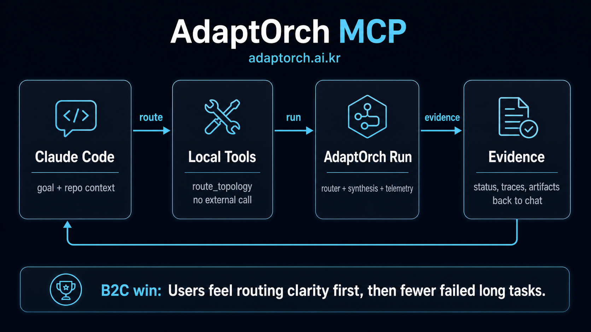

# AdaptOrch MCP

<p align="center">
  <a href="https://adaptorch.com"></a>
</p>

<p align="center">
  <a href="https://adaptorch.com"><strong>adaptorch.com</strong></a>
  ·
  <a href="docs/configuration.md">Configuration</a>
  ·
  <a href="docs/tools.md">Tools</a>
  ·
  <a href="docs/claude-code-b2c.md">Claude Code guide</a>
  ·
  <a href="docs/publishing.md">Publishing</a>
  ·
  <a href="https://arxiv.org/abs/2602.16873">Paper</a>
</p>

<p align="center">
  
  
  
  
  <a href="https://arxiv.org/abs/2602.16873"></a>
</p>

**AdaptOrch MCP** is the public MCP wrapper for [AdaptOrch](https://adaptorch.com): a reliability kernel that lets Claude Code route tasks, launch orchestrated runs, and pull evidence artifacts back into the chat.

Use it when a coding task is too large, too ambiguous, or too expensive to trust to one single-pass response.

```text
Claude Code → AdaptOrch MCP → route topology → run with synthesis → retrieve artifacts
```

## Get your API key

AdaptOrch requires authentication. Get your token in two steps:

1. **Sign up** → [adaptorch.com/app/signup](https://adaptorch.com/app/signup)
2. **Create an API key** → Dashboard → API Key Management → generate a key (starts with `ado_`)

Use that key as `ADAPTORCH_CONTROL_PLANE_TOKEN`:

```bash
export ADAPTORCH_CONTROL_PLANE_TOKEN="ado_..."
```

| Token | Purpose | Where to get it |
| --- | --- | --- |
| `ADAPTORCH_CONTROL_PLANE_TOKEN` | All AdaptOrch API calls (run, status, artifacts) | Dashboard after signup |
| `ADAPTORCH_MCP_HTTP_AUTH_TOKEN` | Protect your local HTTP MCP endpoint | You define it (any secure string) |

Starter `$0` includes API key access, 1,000 calls/month, and shadow mode. See [adaptorch.com](https://adaptorch.com) for Pro/Team plans.

### Engine-delegated optional algorithm controls (latest)

AdaptOrch MCP forwards optional algorithm controls to the installed `adaptorch`
engine. The wrapper does not implement these algorithms. Treat these as
benchmark/eval or operator controls, not quickstart defaults.

| Control | Scope | Verified behavior |
| --- | --- | --- |
| `ADAPTORCH_REPRODUCIBLE` | Benchmark/eval beta | Fixes benchmark clock/RNG sources and canonicalizes record timing/path fields. It does not cover live-provider outputs, parallel-suite record order, cassettes, traces, or report timing aggregates. |
| `manifest_canonical_sha256` | Benchmark manifest | Importable as `adaptorch.benchmarking.manifest_canonical_sha256`; hashes canonical nonvolatile manifest fields. |
| `ADAPTORCH_ROUTER_ACCURACY_GATE` | Online router | `point` is the default; `wilson` uses a Wilson lower bound for learned-model adoption. Pair with operator knobs such as `retrain_window`, `min_loo_accuracy`, `min_posterior`, `quality_floor`, `use_quality_weights`, `use_failure_evidence`, `exploration_rate`, `max_observations`, `cv`, and `kfold_k`. |
| `pass_rate_credit` / `quality_signal` | Online-router learning | `compute_quality` tries exact-answer token matching before fuzzy matching. `pass_rate_credit` is opt-in partial credit; do not claim it changes `AdaptOrchEngine` router feedback by default. |
| `ADAPTORCH_PAPER_SEMANTIC_WEIGHT` | Synthesis | Default is `0.35`. Nonzero semantic weight, plus CJK/Hangul inputs, use Python scoring rather than the native fast path. |
| `prefer_multi_model_ensemble_singleton` | Routing threshold | Auto-enables when at least two ensemble providers exist and synthesis mode is not `direct`, unless an explicit debate-singleton preference wins. The MCP hint `prefer_ensemble_singleton` can request the same preference manually. |

## Research paper

AdaptOrch MCP follows the AdaptOrch research line. Read the paper on arXiv:

- Abstract page: [arxiv.org/abs/2602.16873](https://arxiv.org/abs/2602.16873)
- HTML paper: [arxiv.org/html/2602.16873v1](https://arxiv.org/html/2602.16873v1)

<p align="center">
  <a href="https://arxiv.org/html/2602.16873v1">
    
  </a>
</p>

<p align="center"><sub>Figure preview is sourced from the arXiv HTML version.</sub></p>

## Install

### pip

```bash
pip install adaptorch-mcp
```

If AdaptOrch core is not yet on PyPI, install it from GitHub first:

```bash
pip install "adaptorch[api] @ git+https://github.com/dmae97/adaptorch.git"
pip install adaptorch-mcp
```

### uvx (one-shot, no install)

```bash
uvx adaptorch-mcp --help
```

With the adaptorch dependency from GitHub:

```bash
uvx --with "adaptorch[api] @ git+https://github.com/dmae97/adaptorch.git" adaptorch-mcp --help
```

## Why Claude Code users feel it quickly

| First-run win | Tool | What changes in the chat |
| --- | --- | --- |
| Less planning uncertainty | `adaptorch_route_topology` | Claude can explain whether the task should be singleton, pipeline, DAG, or ensemble before spending run budget. |
| Fewer failed long tasks | `adaptorch_run` | Large goals move through AdaptOrch routing, synthesis, and telemetry instead of one brittle pass. |
| Evidence without context switching | `adaptorch_get_artifacts` | Outputs, traces, and run proof come back into the Claude Code conversation. |
| Safer setup support | `adaptorch-mcp-doctor` | Users can paste redacted diagnostics without leaking tokens. |
| Fast install loop | `adaptorch-mcp-smoke` | Local MCP wiring is verified with `initialize` + `tools/list`. |

## Architecture

<p align="center">
  
</p>

## Packages

| Path | Package | Purpose |
| --- | --- | --- |
| `packages/adaptorch-mcp` | `adaptorch-mcp` | Python CLI wrapper around `adaptorch.mcp_server` |

The wrapper intentionally delegates runtime behavior to `adaptorch.mcp_server`. That keeps MCP tools, resources, prompts, safety checks, and transports aligned with the latest AdaptOrch core release.

## Quickstart

### Local development

```bash
git clone git@github.com:dmae97/Adaptorch-MCP.git
git clone git@github.com:dmae97/adaptorch.git  # alongside Adaptorch-MCP
cd Adaptorch-MCP
uv sync --all-packages --extra dev
uv run adaptorch-mcp --help
```

## stdio MCP

Use stdio for local clients such as Claude Code or desktop MCP hosts.

```bash
export ADAPTORCH_CONTROL_PLANE_TOKEN="<your-token>"
adaptorch-mcp --transport stdio --base-url https://adaptorch.com
```

## HTTP MCP

Use HTTP for local gateways, reverse proxies, or remote MCP clients.

```bash
export ADAPTORCH_CONTROL_PLANE_TOKEN="<upstream-adaptorch-token>"
export ADAPTORCH_MCP_HTTP_AUTH_TOKEN="<client-facing-mcp-token>"

adaptorch-mcp \
  --transport http \
  --base-url https://adaptorch.com \
  --http-host 127.0.0.1 \
  --http-port 8765
```

Health check:

```bash
python - <<'PY'
import httpx
print(httpx.get('http://127.0.0.1:8765/mcp/health').json())
PY
```

## CLI and environment reference

| Command | Purpose | Important options |
| --- | --- | --- |
| `adaptorch-mcp` | Start the stdio or HTTP MCP server. | `--transport stdio|http`, `--base-url`, `--api-token`, `--timeout-seconds`, `--stdio-framing`, `--http-host`, `--http-port`, `--http-auth-token` |
| `adaptorch-mcp-doctor` | Print redacted local diagnostics. | `--json`, `--strict` |
| `adaptorch-mcp-smoke` | Verify stdio `initialize` + `tools/list`. | `--command`, `--base-url`, `--api-token`, `--timeout-seconds`, repeatable `--expected-tool` |

For `adaptorch-mcp`, the public wrapper resolves the control-plane URL in this
order: explicit `--base-url`, then trimmed/validated
`ADAPTORCH_CONTROL_PLANE_BASE_URL`, then the hosted fallback
`https://adaptorch.com`. `adaptorch-mcp-smoke` keeps a local-dev fallback of
`http://127.0.0.1:8000` when no base URL is configured. Pass `--base-url`
explicitly in checked-in MCP client configs for reproducible behavior.

| Variable | Purpose | Notes |
| --- | --- | --- |
| `ADAPTORCH_CONTROL_PLANE_TOKEN` | Upstream AdaptOrch token. | Required unless `--api-token` is passed. |
| `ADAPTORCH_CONTROL_PLANE_BASE_URL` | Base URL used when `--base-url` is omitted. | Trimmed and validated as HTTP(S); do not embed credentials. |
| `ADAPTORCH_MCP_HTTP_AUTH_TOKEN` | Client-facing bearer token for HTTP/SSE MCP. | Keep separate from the upstream control-plane token. |
| `ADAPTORCH_MCP_ALLOWED_ORIGINS` | Comma-separated HTTP origin allowlist. | Use with browser or remote HTTP clients. |
| `ADAPTORCH_MCP_MAX_PAYLOAD_SIZE_BYTES` | Maximum accepted HTTP request body size. | Keep bounded for public deployments. |
| `ADAPTORCH_MCP_REQUEST_TIMEOUT_SECONDS` | HTTP request timeout budget. | Applies to HTTP server request handling. |
| `ADAPTORCH_MCP_MAX_SSE_SUBSCRIBERS` | Maximum concurrent SSE subscribers. | Defaults are provided by `adaptorch.mcp_server`. |
| `ADAPTORCH_MCP_TIMEOUT_SECONDS` | Control-plane client timeout for app-factory usage. | Useful when embedding the ASGI app. |
| `ADAPTORCH_REPRODUCIBLE` | Benchmark/eval reproducibility beta. | Benchmark/eval scope only; not general runtime determinism. |
| `ADAPTORCH_ROUTER_ACCURACY_GATE` | Online-router learned-model gate. | `point` default or `wilson`; advanced/operator use. |
| `ADAPTORCH_PAPER_SEMANTIC_WEIGHT` | Paper-mode lexical/semantic blend. | Default `0.35`; nonzero values use Python scoring over the native fast path. |

## Claude Code MCP config

```json
{
  "mcpServers": {
    "adaptorch": {
      "command": "adaptorch-mcp",
      "args": [
        "--transport",
        "stdio",
        "--base-url",
        "https://adaptorch.com"
      ],
      "env": {
        "ADAPTORCH_CONTROL_PLANE_TOKEN": "${ADAPTORCH_CONTROL_PLANE_TOKEN}"
      }
    }
  }
}
```

More templates:

- `examples/claude_desktop_config.json`
- `examples/omk.mcp.json`
- `examples/mcp-http.env.example`

Checked-in examples use placeholders or environment interpolation. Fill real
URLs and tokens only in local, uncommitted config files.

## Diagnostics

Print redacted local diagnostics:

```bash
adaptorch-mcp-doctor
adaptorch-mcp-doctor --json
adaptorch-mcp-doctor --strict
```

Run a stdio smoke test. The token is passed through the child environment, not process arguments. If no base URL is supplied, smoke targets `http://127.0.0.1:8000` for local development.

```bash
export ADAPTORCH_CONTROL_PLANE_TOKEN="<your-token>"
adaptorch-mcp-smoke --base-url https://adaptorch.com
```

Expected JSON includes `"ok": true`, `adaptorch_plan_catalog`, and the expected
core tool subset. Doctor JSON also includes redacted `controlPlane` metadata for
the resolved base-url source. Add repeatable `--expected-tool <name>` flags when
validating a specific hosted/core release.

## Tool surface

| Tool | Purpose |
| --- | --- |
| `adaptorch_run` | Submit an AdaptOrch task payload and optionally wait. |
| `adaptorch_get_run` | Read run summary by `run_id`. |
| `adaptorch_get_artifacts` | Read artifact metadata for a run. |
| `adaptorch_list_runs` | List recent runs. |
| `adaptorch_get_traces` | Read execution traces. |
| `adaptorch_cancel_run` | Request run cancellation (write/destructive; keep manually approved). |
| `adaptorch_route_topology` | Locally route a DAG through AdaptOrch's topology router. |
| `adaptorch_server_metrics` | Read redacted MCP server metrics. |
| `adaptorch_capabilities` | Read synthesis modes, connectors, and server features. |
| `adaptorch_plan_catalog` | Read hosted plan catalog: Starter `$0`, Pro `$39`, Team `$149`. |

For trusted local clients, auto-approve only tools whose outputs are safe for
that client. Keep `adaptorch_run` and `adaptorch_cancel_run` manually approved.
For shared or production clients, avoid auto-approving run, artifact, and trace
readers unless those payloads are already sanitized.

## Branding assets

- GitHub hero: `assets/readme-hero.png`
- GitHub flow diagram: `assets/mcp-flow.png`
- GPT-image-2.0 raster prompt brief: `docs/brand/gpt-image-2-brief.md`

## Public release checklist

Before publishing:

```bash
uv run ruff check packages/adaptorch-mcp
uv run mypy packages/adaptorch-mcp/src
uv run pytest packages/adaptorch-mcp/tests -q
uv run python -m build packages/adaptorch-mcp --outdir dist
uv publish --dry-run dist/*
```

Then follow `docs/publishing.md` for PyPI Trusted Publishing or token-based `uv publish`.

## Security

Never commit `.env`, API keys, bearer tokens, private keys, or MCP client tokens. See `SECURITY.md`.

## License

Proprietary — Copyright EGG. All rights reserved. See `LICENSE`.
